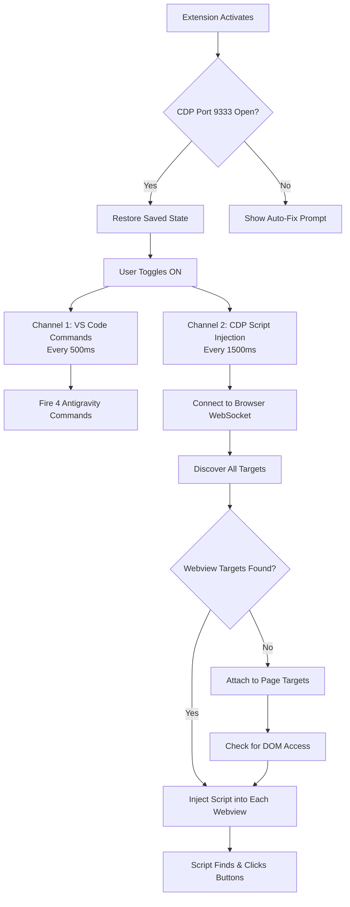

# AntiGravity AutoAccept — Full Technical Analysis

## What It Does

This VS Code extension automatically clicks **Run**, **Accept**, **Always Allow**, and other permission buttons in Antigravity IDE's AI agent panel — so the agent can work autonomously without you manually approving every step.

---

## Architecture Overview

The extension operates on **two parallel channels**, each designed to handle a different category of buttons:



---

## Channel 1: VS Code Commands API (Lines 13–18, 360–383)

**What it does**: Fires 4 Antigravity-specific commands every 500ms.

```javascript
const ACCEPT_COMMANDS = [
    'antigravity.agent.acceptAgentStep',    // Accepts file edits, proceed prompts
    'antigravity.terminalCommand.accept',    // Accepts "Run this command?" prompts
    'antigravity.terminalCommand.run',       // Executes terminal commands
    'antigravity.command.accept',            // Accepts inline editor commands
];
```

**Why only 4 commands?** An audit of all 2,834 registered VS Code commands (documented in `COMMAND_AUDIT.md`) found that generic commands like `chatEditing.acceptAllFiles` cause sidebar interference — toggling the Outline panel, collapsing folders — when the agent panel doesn't have focus. Only these 4 are safe.

### Async Lock (Lines 370–382)

```
isAccepting = true → fire all 4 commands → isAccepting = false
```

Without this lock, overlapping poll cycles could fire the same command twice in parallel, causing race conditions. A **3-second safety timeout** force-releases the lock if commands hang.

**Why this channel works**: VS Code's internal command system directly triggers the same action as clicking the button in the UI. No DOM access needed — it just works. But it **cannot** handle permission dialogs ("Always Allow", "Allow this conversation") because those are rendered inside a webview, not exposed as VS Code commands.

---

## Channel 2: CDP Script Injection (Lines 24–327)

**What it does**: Connects to Chromium's DevTools Protocol to inject JavaScript directly into the agent panel's webview DOM, finding and clicking buttons that the Commands API can't reach.

### Why CDP Is Necessary

Antigravity's permission dialogs (tool approval, MCP access) are rendered inside an **isolated Chromium webview** — a mini browser inside the IDE. There are no VS Code commands for "Always Allow" or "Allow this conversation". The only way to click them is to reach into the webview's DOM.

### Step 1: Find the Debug Port (Lines 172–191)

The extension uses a strict **2-port fallback** strategy:
1. **Configured port** (default `9333`) — checked first
2. **Legacy port `9222`** — fallback only if the configured port is unavailable

Once a working port is found, it's cached in `activeCdpPort` so future cycles skip the scan. The extension fetches the **browser-level WebSocket URL** from `/json/version` — this is the master connection that can see all targets.

### Step 2: Connect & Discover Targets (Lines 193–245)

```
Browser WebSocket → Target.setDiscoverTargets → Target.getTargets
```

This returns every rendering target in the IDE: page windows, webview iframes, service workers. The extension filters for **webview targets** by looking for URLs containing `vscode-webview://` or `webview`, or targets typed as `iframe`.

### Step 3: The Fallback Path (Lines 247–283)

Antigravity recently migrated webviews to **Out-Of-Process Iframes (OOPIF)**. In some versions, webview targets don't appear in the target list at all. When this happens, the extension falls back to:

1. Attach to each **page target** with `Target.attachToTarget({ flatten: true })`
2. Check if the page has DOM access: `typeof document !== "undefined"`
3. If yes, inject the clicker script there

This `flatten: true` is critical — it creates a **flattened session** that can communicate directly with the target without a separate WebSocket connection.

### Step 4: The Injected Script (Lines 24–136)

This is the heart of the extension — a self-contained IIFE injected via `Runtime.evaluate` into each webview/page target.

#### Webview Guard (Lines 34–42)

```javascript
if (!document.querySelector('.react-app-container') && 
    !document.querySelector('[class*="agent"]') &&
    !document.querySelector('[data-vscode-context]')) {
    return 'not-agent-panel';
}
```

**Why?** CDP injects into ALL targets — including the main VS Code window. Without this guard, the script would walk the entire IDE's DOM and click random things (sidebar folders, menus, markdown text). The `.react-app-container` class only exists in the agent panel's React app.

#### Button Finding: `findButton()` (Lines 61–108)

Uses `document.createTreeWalker` to walk every DOM element depth-first:

1. **Shadow DOM piercing**: If a node has `.shadowRoot`, recursively search inside it
2. **data-testid shortcut**: Elements with `data-testid="alwaysallow"` or `data-action="always-allow"` are matched immediately (bypasses text matching)
3. **Text matching** with two strategies:
   - **Exact match**: `nodeText === text` — always works (e.g., button says exactly "run")
   - **Prefix match**: `nodeText.startsWith(text)` — only for terms ≥ 5 chars, with a 3× length cap. This lets "always allow some tool" match "always allow", but prevents "run" from matching "running tests"
4. **Ancestor traversal**: `closestClickable()` walks up from the matched text node to find the nearest button-like ancestor (`<button>`, `role="button"`, `tabindex="0"`, `.cursor-pointer`)
5. **Reject filters**: Skips disabled buttons, `aria-disabled="true"`, `.loading` class, and `.codicon-loading` spinners

#### Per-Element Cooldown: `data-aa-t` (Lines 98–102, 114, 127)

```javascript
var lastClickTime = parseInt(clickable.getAttribute('data-aa-t') || '0', 10);
if (lastClickTime && (Date.now() - lastClickTime < 5000)) {
    return null;  // Skip — already clicked this element
}
// Before clicking:
btn.setAttribute('data-aa-t', '' + Date.now());
btn.click();
```

After clicking, the element is **stamped** with a `data-aa-t` attribute containing the timestamp. For 5 seconds, the script will skip that exact element. This prevents:
- Spam-clicking a static "Run" label that isn't a real button
- Double-clicking the same button on consecutive poll cycles

But a **new** Run button (different DOM element) gets clicked immediately.

#### Two-Pass Priority (Lines 110–133)

| Pass | Priority | Texts | Purpose |
|------|----------|-------|---------|
| 1 | Highest → Lowest | `run`, `accept`, `always allow`, `allow this conversation`, `allow`, custom... | Action & permission buttons |
| 2 | Fallback | `expand`, `requires input` | Reveal hidden steps (virtualized list) |

Pass 2 only runs if Pass 1 found nothing. The `CAN_EXPAND` gate prevents expand loops — it's set to `false` if the expand button on this target was clicked within the last 8 seconds.

### Step 5: Concurrent Broadcast (Lines 286–314)

```javascript
const evalPromises = webviews.map(async (wv) => { ... });
await Promise.allSettled(evalPromises);
```

All webview targets are evaluated **concurrently** via `Promise.allSettled`. This means if you have multiple chat windows open (via File → Duplicate Workspace), buttons in ALL chats get clicked in the same cycle.

---

## CDP Auto-Fix System (Lines 398–520)

### Problem

CDP requires launching Antigravity with `--remote-debugging-port=9222`. If the flag is missing, the extension can't connect.

### Solution: Automatic Shortcut Patching (Lines 433–509)

On activation, the extension checks if port 9222 is open. If refused:

1. Shows an error with "Auto-Fix Shortcut (Windows)" button
2. If clicked, writes a PowerShell script to `%TEMP%`
3. The script scans Desktop, Public Desktop, and Start Menu for `.lnk` files
4. Finds shortcuts targeting `*Antigravity*`
5. Appends `--remote-debugging-port=9222` to the shortcut's Arguments
6. Cleans up the temp script
7. Prompts the user to restart

This is a **one-time permanent fix** — after patching, every future launch automatically enables CDP.

---

## State Management

| Variable | Type | Purpose |
|----------|------|---------|
| `isEnabled` | `boolean` | Master ON/OFF toggle, persisted in `globalState` |
| `isAccepting` | `boolean` | Async lock for VS Code commands — prevents double-fires |
| `isCdpBusy` | `boolean` | Async lock for CDP — prevents overlapping WebSocket sessions |
| `activeCdpPort` | `number\|null` | Cached working port — skips port scanning on future cycles |
| `lastExpandTimes` | `{targetId: timestamp}` | Per-target expand cooldown (8s) — prevents toggle loops |
| `pollIntervalId` | `number` | Commands polling timer ID |
| `cdpIntervalId` | `number` | CDP polling timer ID |

---

## Timing

| Event | Interval | Why |
|-------|----------|-----|
| VS Code Commands | 500ms | Fast — commands are cheap (no I/O), agent can produce commands quickly |
| CDP Script Injection | 1500ms | Slower — each cycle opens a WebSocket, attaches to targets, evaluates scripts. Too fast would overwhelm Chromium |
| Element cooldown (`data-aa-t`) | 5000ms | Prevents re-clicking the same DOM element (anti-spam) |
| Expand cooldown | 8000ms | Prevents expand/collapse toggle loops on the same target |
| WebSocket timeout | 5000ms | Safety — closes the connection if CDP hangs |
| Command timeout | 2000ms | Safety — per-message timeout for CDP requests |
| Lock safety timeout | 3000ms | Force-releases `isAccepting` if VS Code commands never resolve |

---

## Why It Works — The Key Insight

Antigravity IDE is a **VS Code fork running on Electron**, which means it's a Chromium browser under the hood. Every UI panel — the editor, the sidebar, the agent chat — is a separate Chromium rendering target. By launching with `--remote-debugging-port=9222`, we expose Chrome DevTools Protocol on localhost, giving the extension direct access to inject JavaScript into any rendering context.

The agent panel's permission dialogs are React components rendered inside an isolated webview. They're invisible to the VS Code Extension API, but fully accessible to CDP's `Runtime.evaluate`. We inject a self-contained IIFE that:

1. **Guards** against running in the wrong target (webview guard)
2. **Walks** the DOM tree looking for button-like elements with matching text
3. **Clicks** them programmatically via `.click()`
4. **Stamps** them to prevent re-clicking

This two-layer approach (Commands API + CDP) covers 100% of approval scenarios:
- **Commands API** handles: terminal commands, file edits, agent step approvals
- **CDP** handles: tool permissions, MCP access, "Always Allow", any future webview-based dialog

The architecture is inherently **future-proof** — any new tool Google adds to Antigravity will fire the same `ask_tool_permission` webview payload, and our DOM text-walker will find and click it automatically.
