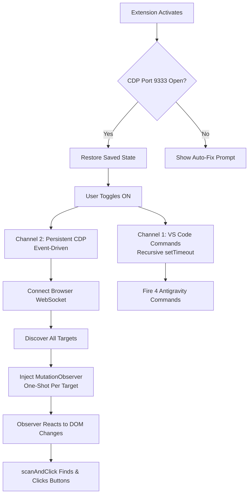

# AntiGravity AutoAccept v3.0.0 — Full Technical Analysis

## What It Does

This VS Code extension automatically clicks **Run**, **Accept**, **Always Allow**, **Continue**, and other permission buttons in Antigravity IDE's AI agent panel — so the agent can work autonomously without you manually approving every step.

---

## Architecture Overview

The extension operates on **two parallel channels**, each designed to handle a different category of buttons:



### Module Structure

| File | Lines | Responsibility |
|------|-------|---------------|
| `src/extension.js` | ~295 | VS Code lifecycle, command polling (recursive setTimeout + Promise.race), status bar, auto-fix patcher |
| `src/cdp/ConnectionManager.js` | ~430 | Persistent WebSocket, session pool, target lifecycle events, self-healing reconnection |
| `src/scripts/DOMObserver.js` | ~210 | MutationObserver payload generator — injected once per target, reacts instantly to DOM changes |

---

## Channel 1: VS Code Commands API (`src/extension.js`)

**What it does**: Fires 4 Antigravity-specific commands using recursive `setTimeout`.

```javascript
const ACCEPT_COMMANDS = [
    'antigravity.agent.acceptAgentStep',    // Accepts file edits, proceed prompts
    'antigravity.terminalCommand.accept',    // Accepts "Run this command?" prompts
    'antigravity.terminalCommand.run',       // Executes terminal commands
    'antigravity.command.accept',            // Accepts inline editor commands
];
```

**Why only 4 commands?** An audit of all 2,834 registered VS Code commands (documented in `COMMAND_AUDIT.md`) found that generic commands like `chatEditing.acceptAllFiles` cause sidebar interference — toggling the Outline panel, collapsing folders — when the agent panel doesn't have focus. Only these 4 are safe.

### Sequential Execution with Timeout Safety

```javascript
async function pollCycle() {
    if (!isEnabled) return;
    try {
        const timeoutPromise = new Promise(resolve => setTimeout(resolve, 3000));
        const commandsPromise = Promise.allSettled(
            ACCEPT_COMMANDS.map(cmd => vscode.commands.executeCommand(cmd))
        );
        await Promise.race([commandsPromise, timeoutPromise]);
    } catch (e) { /* silent */ }
    if (isEnabled) {
        pollIntervalId = setTimeout(pollCycle, interval);
    }
}
```

Uses recursive `setTimeout` instead of `setInterval` to guarantee strict sequential execution — the next cycle only starts after the current one completes (or the 3s safety timeout fires). This prevents both lock corruption and permanent polling hangs if `executeCommand` becomes unresponsive.

---

## Channel 2: Persistent CDP with MutationObserver (`ConnectionManager.js` + `DOMObserver.js`)

### Why CDP Is Necessary

Antigravity's permission dialogs (tool approval, MCP access) are rendered inside an **isolated Chromium webview** (OOPIF). There are no VS Code commands for "Always Allow" or "Allow this conversation". The only way to click them is to reach into the webview's DOM via Chrome DevTools Protocol.

### Architecture: Connect Once → Inject Once → React Forever

Unlike v2.x (which polled every 1.5s with attach→evaluate→detach), v3.0.0 maintains a **persistent browser-level WebSocket** and uses **one-shot MutationObserver injection**:

1. **Connect** to browser-level WebSocket via `/json/version`
2. **Enable target discovery** — `Target.setDiscoverTargets` for real-time events
3. **Attach to targets** — create flattened sessions for each webview/page
4. **Inject MutationObserver** — one-shot script that runs autonomously
5. **React to events** — target lifecycle, context clears, new targets

### ConnectionManager (`src/cdp/ConnectionManager.js`)

```javascript
// Event-driven target discovery — no polling needed
_onMessage(raw) {
    const msg = JSON.parse(raw.toString());
    switch (msg.method) {
        case 'Target.targetCreated':
            this._handleNewTarget(msg.params.targetInfo);
            break;
        case 'Target.targetDestroyed':
            this._handleTargetDestroyed(msg.params.targetId);
            break;
        case 'Runtime.executionContextsCleared':
            // Webview navigated — re-inject observer
            if (msg.sessionId) this._reinjectForSession(msg.sessionId);
            break;
    }
}
```

**Session Pool**: `Map<targetId, sessionId>` keeps sessions alive. Rejected targets are cached in `ignoredTargets` Set (cleaned on target destruction) to avoid re-evaluation.

**Self-Healing**:
- WebSocket close → automatic reconnect with 3s backoff
- Context clear → re-inject observer
- Heartbeat every 30s: health check + discover new targets + clean stale `ignoredTargets`

### DOMObserver (`src/scripts/DOMObserver.js`)

The heart of the extension — a self-contained IIFE injected once per CDP session via `Runtime.evaluate`.

#### Idempotency Guard

```javascript
if (window.__AA_OBSERVER_ACTIVE) return 'already-active';
window.__AA_OBSERVER_ACTIVE = true;
```

Prevents double-injection if CDP sends the script again on the same execution context.

#### Deferred Webview Guard

```javascript
function isAgentPanel() {
    return !!(document.querySelector('.react-app-container') ||
        document.querySelector('[class*="agent"]') ||
        document.querySelector('[data-vscode-context]'));
}
```

The guard runs dynamically inside `scanAndClick()` — not at injection time. This avoids a race condition where the DOM is unhydrated (empty) on `Target.targetCreated` or `Runtime.executionContextsCleared`. The observer installs unconditionally, then checks the DOM structure on each scan.

#### Button Finding: `findButton()`

Uses `document.createTreeWalker` to walk every DOM element depth-first:

1. **Shadow DOM piercing**: If a node has `.shadowRoot`, recursively search inside it
2. **data-testid shortcut**: Elements with `data-testid="alwaysallow"` or `data-action="always-allow"` are matched immediately
3. **Text matching**:
   - **Exact match**: `nodeText === text` — always works
   - **Prefix match**: `nodeText.startsWith(text)` — only for terms ≥ 5 chars, with 3× length cap
   - **Word-boundary prefix**: `text + ' '` with 5× cap for short terms
4. **Ancestor traversal**: `closestClickable()` walks up to find `<button>`, `role="button"`, `tabindex="0"`, `.cursor-pointer`
5. **Reject filters**: `disabled`, `aria-disabled`, `.loading`, `.codicon-loading`

#### Closure-Scoped Cooldowns with Sibling-Indexed Paths

All cooldowns are localized inside the injected script via a closure-scoped `clickCooldowns` map, keyed by structural DOM path + text hash. The `_domPath()` function iterates 4 levels from the target element itself, with sibling indices at every level to guarantee unique paths even for direct siblings:

```javascript
function _domPath(el) {
    var parts = [];
    var curr = el;
    for (var i = 0; i < 4 && curr && curr !== document.body; i++) {
        var idx = 0;
        var child = curr.parentElement ? curr.parentElement.firstElementChild : null;
        while (child) {
            if (child === curr) break;
            idx++;
            child = child.nextElementSibling;
        }
        parts.unshift((curr.tagName || '') + '[' + idx + ']');
        curr = curr.parentElement;
    }
    return parts.join('/');
}
// Output: DIV[0]/BUTTON[0], DIV[0]/BUTTON[1] — unique per sibling
```

Pruned every 30s to prevent memory leaks.

#### Two-Pass Priority

| Pass | Priority | Texts | Purpose |
|------|----------|-------|---------| 
| 1 | Highest → Lowest | `run`, `accept`, `always allow`, `allow this conversation`, `allow`, `retry`, `continue`, custom... | Action & permission buttons |
| 2 | Fallback | `expand`, `requires input` | Reveal hidden steps (virtualized list) |

#### MutationObserver with Leading-Edge Throttle

```javascript
var debounceTimer = null;
var observer = new MutationObserver(function() {
    if (debounceTimer) return;
    debounceTimer = setTimeout(function() {
        debounceTimer = null;
        scanAndClick();
    }, 100);
});
observer.observe(document.body, { childList: true, subtree: true });
```

Uses 100ms leading-edge throttle to fire `scanAndClick()` on the first mutation, then coalesce subsequent mutations during the throttle window. This is optimal because Antigravity buttons appear at the start of mutation bursts (React mounts button → then streams text).

---

## CDP Auto-Fix System (`src/extension.js`)

### Problem

CDP requires launching Antigravity with `--remote-debugging-port=9333`. If the flag is missing, the extension can't connect.

### Solution: Automatic Shortcut Patching

On activation, the extension uses a dual-port strategy:
1. **Configured port** (default `9333`) — checked first
2. **Legacy port `9222`** — fallback only

If both fail, it offers automatic Windows shortcut patching via fileless PowerShell execution (UTF-16LE Base64 `EncodedCommand`). The script scans Desktop, Public Desktop, and Start Menu for `.lnk` files targeting Antigravity and appends the flag. Guarded by `process.platform === 'win32'` — non-Windows platforms get a safe log message.

**Restart** uses a WMI Escape Hatch — spawns a sleeper process under `WmiPrvSE.exe` (outside the IDE's Job Object) that waits 2s for the single-instance lock release, then launches the patched shortcut. Path is Base64-encoded to safely handle Unicode and special characters.

---

## State Management

| Variable | Type | Purpose |
|----------|------|---------|
| `isEnabled` | `boolean` | Master ON/OFF toggle, persisted in `globalState` |
| `connectionManager` | `ConnectionManager` | Persistent CDP session manager |
| `sessions` | `Map<targetId, sessionId>` | Active CDP session pool |
| `ignoredTargets` | `Set<targetId>` | Targets rejected by Webview Guard |
| `clickCooldowns` | `Object` (closure) | Per-element click cooldowns (5s action, 8s expand) |

---

## Timing

| Event | Interval | Why |
|-------|----------|-----|
| VS Code Commands | 500ms | Fast — commands are cheap (no I/O) |
| MutationObserver throttle | 100ms | Leading-edge — fires on first mutation, coalesces rest |
| Element cooldown | 5000ms | Prevents re-clicking same button |
| Expand cooldown | 8000ms | Prevents expand/collapse toggle loops |
| Cooldown pruning | 30000ms | Prevents clickCooldowns memory leak |
| Heartbeat | 30000ms | Health check + new target discovery |
| Reconnect backoff | 3000ms | Self-healing after connection loss |
| CDP message timeout | 5000ms | Per-message safety timeout |
| Command timeout | 3000ms | Promise.race safety — prevents polling hang |

---

## Dependency Graph

```
package.json (entry: ./src/extension.js)
├── src/extension.js (VS Code lifecycle + command polling)
│   ├── vscode (VS Code API)
│   ├── child_process (PowerShell patcher)
│   ├── http (CDP port ping)
│   └── src/cdp/ConnectionManager.js (persistent CDP)
│       ├── ws (WebSocket client — only npm dependency)
│       ├── http (browser WS URL fetch)
│       └── src/scripts/DOMObserver.js (payload generator)
└── test/permission-engine.test.js (49 tests, zero deps)
```

**Single npm dependency:** `ws` ^8.19.0
