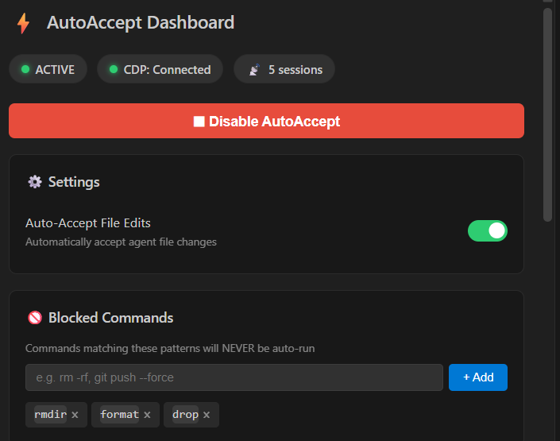

# AntiGravity AutoAccept
<!-- v3.8.2 browser subagent compatibility -->

[](https://buymeacoffee.com/yazanbaker)

> **📢 Sponsor this extension** — With **10,000+ installs** and an active user base, your brand gets prime placement on every user's dashboard. Reach developers who automate their workflows daily. Contact **autoaccept@sakinahtime.com** to get started.

Automatically accept agent steps, terminal commands, file edits, and permission prompts in [Antigravity](https://antigravity.dev) — Google's AI coding assistant.

## What it does

When the Antigravity agent proposes file edits, terminal commands, or asks for tool permissions, this extension auto-accepts them so you don't have to click every button manually.

**Two strategies, zero interference:**

| Strategy | What it handles | How |
|---|---|---|
| **VS Code Commands** (500ms) | Agent steps, terminal commands | Calls Antigravity's native accept commands |
| **CDP + MutationObserver** (event-driven) | Run, Accept, Always Allow, Continue | One-shot script injected once, reacts instantly to DOM changes |

## Setup

### 1. Enable Debug Mode (Required)

The extension needs Chrome DevTools Protocol to click permission buttons. Launch Antigravity with:
```
--remote-debugging-port=9333
```

> **Why port 9333?** Antigravity's built-in Browser Control (Chrome button in the toolbar) uses port 9222 by default. Using the same port causes an `EADDRINUSE` conflict on macOS/Linux. Port 9333 avoids this entirely. *(Thanks to [u/unlike_a_boss](https://www.reddit.com/user/unlike_a_boss/) for discovering this!)*

<details>
<summary><b>🪟 Windows</b></summary>

**Automatic:** On first launch, the extension detects if the port is closed and shows **"Auto-Fix Shortcut"** — click it to automatically patch your `.lnk` shortcut.

**Manual:** Right-click your Antigravity shortcut → Properties → append to Target:
```
--remote-debugging-port=9333
```

</details>

<details>
<summary><b>🍎 macOS</b></summary>

**Option 1 — Automator App (recommended):**
1. Open **Automator** → New Document → **Application**
2. Search for **"Run Shell Script"** in the library
3. Paste: `open -a "Antigravity" --args --remote-debugging-port=9333`
4. Save as "AntiGravity Launcher" to Desktop or Applications

**Option 2 — Terminal alias** (add to `~/.zshrc`):
```bash
alias antigravity='open -a "Antigravity" --args --remote-debugging-port=9333'
```

> **Note:** The app name must match exactly. Check with `ls /Applications/ | grep -i anti`

**Option 3 — Direct Electron binary** (if `open -a` doesn't pass args correctly):
```bash
alias antigravity='/Applications/Antigravity.app/Contents/MacOS/Electron --remote-debugging-port=9333 & disown'
```
*(Thanks to [@aangelinsf](https://github.com/aangelinsf))*

</details>

<details>
<summary><b>🐧 Linux</b></summary>

**Option 1 — Edit the `.desktop` file:**
```bash
# Find it:
find /usr/share/applications ~/.local/share/applications -name "*ntigravity*" 2>/dev/null

# Edit the Exec line:
Exec=/path/to/antigravity --remote-debugging-port=9333 %F
```

**Option 2 — Shell alias** (add to `~/.bashrc` or `~/.zshrc`):
```bash
alias antigravity='antigravity --remote-debugging-port=9333'
```

**Option 3 — Wrapper script:**
```bash
#!/bin/bash
/opt/Antigravity/antigravity --remote-debugging-port=9333 "$@"
```

</details>

### 2. Install the Extension

**From VSIX (recommended):**
1. Download the latest `.vsix` from [Releases](https://github.com/yazanbaker94/AntiGravity-AutoAccept/releases/)
2. In Antigravity: `Ctrl+Shift+P` → `Extensions: Install from VSIX`
3. Select the downloaded file
4. Reload Window

**Manual:**
1. Copy the `src/` directory, `package.json`, and `package-lock.json` to:
   ```
   ~/.antigravity/extensions/YazanBaker.antigravity-autoaccept-3.4.0/
   ```
2. Run `npm install` in that directory (installs `ws` dependency)
3. Reload Window

## Usage

- **Toggle:** Click `⚡ Auto: ON` / `✕ Auto: OFF` in the status bar
- **Or:** `Ctrl+Shift+P` → `AntiGravity AutoAccept: Toggle ON/OFF`
- **Dashboard:** Click `📊` in the status bar to see CDP status, active sessions, and activity log
- **Logs:** Output panel → `AntiGravity AutoAccept`



## Multi-Agent Workflow

### ⚠️ Agent Manager Limitation

Antigravity's Agent Manager uses a **single shared webview** — only the active conversation's DOM is rendered. Background conversations are completely unmounted. Both the VS Code Commands API and CDP can only reach the currently visible conversation.

We verified this by decompiling Antigravity's source code: their accept command handlers are hardcoded to `vscode.window.activeTerminal` with zero arguments — there is no way to target a specific conversation.

> **This is an Antigravity architectural limitation, not an extension bug.** It would require Antigravity to implement a cross-conversation accept command (e.g. `antigravity.agent.acceptAll`).

### Workaround: Duplicate Workspace

To run multiple agents with auto-accept on all of them:

1. Click **File → Duplicate Workspace**
2. This opens a second Antigravity window connected to the same project
3. Start a chat in Window 1 and another chat in Window 2
4. Each window has its own webview — the extension auto-clicks buttons in **both windows simultaneously**

## Settings

| Setting | Default | Scope | Description |
|---|---|---|---|
| `autoAcceptV2.pollInterval` | `500` | window | Polling interval in ms |
| `autoAcceptV2.customButtonTexts` | `[]` | application | Extra button texts for i18n or custom prompts |
| `autoAcceptV2.cdpPort` | `9333` | machine | CDP port (default avoids conflict with AG Browser Control on 9222) |
| `autoAcceptV2.autoAcceptFileEdits` | `true` | window | Auto-accept file edit changes (disable to review diffs manually) |
| `autoAcceptV2.blockedCommands` | `[]` | application | Commands to NEVER auto-run (e.g. `rm`, `git push`, `npm publish`) |
| `autoAcceptV2.allowedCommands` | `[]` | application | If set, ONLY these commands will auto-run (whitelist mode) |

> **Tip:** Settings are hot-reloaded — changes take effect immediately without restarting.

## How it Works

### Persistent CDP + MutationObserver (v3.0.0+)
The extension maintains a **persistent browser-level WebSocket** connection to Chromium's DevTools Protocol. Instead of polling every 1.5s, it injects a **MutationObserver** payload once per target. The observer reacts instantly when React mounts new button elements, with 100ms leading-edge throttle to prevent CPU spikes during streaming output. The extension uses a **whitelist-only target filter** — it only attaches to `vscode-webview://` targets and automatically yields the CDP port when the AG browser sub-agent is detected, preventing ArrayBuffer conflicts.

### Single-Pass DOM Scanner (v3.1.0)
The button scanner walks the DOM tree **exactly once** per cycle, checking all keywords simultaneously against each node. This is O(D) instead of the previous O(N×D) which could cause UI freezes with many keywords. Priority-aware matching ensures `Run` always beats `Accept`, which always beats `Allow`, regardless of DOM order.

### Webview Guard
Antigravity's agent panel runs in an isolated Chromium process (OOPIF). The injected script uses a deferred `isAgentPanel()` check inside `scanAndClick()` — verifying `.react-app-container` existence dynamically on each scan rather than at injection time. This avoids a race condition where the DOM is unhydrated on `targetCreated`.

### Heartbeat Self-Healing (v3.2.0)
The CDP connection validates existing sessions every heartbeat cycle (10s). If a session's MutationObserver is dead (execution context cleared by webview navigation or React hot-reload), it automatically re-injects the observer — no reconnection needed. Sessions unreachable 3 times consecutively are cleanly detached and pruned. The heartbeat also handles **target discovery** (replacing the removed `Target.setDiscoverTargets` subscription to avoid CDP conflicts with the AG browser sub-agent). *(Fixes the "stops clicking after ~1 hour" bug and the "Cannot freeze array buffer views" crash.)*

### Expand Button Loop Prevention (v3.5.1)
Expand-type buttons (e.g. browser preview "Expand") use a **click-once-per-session** rule: once clicked, they are permanently suppressed for that CDP session via an `expandedOnce` Set. This prevents the infinite overlay re-open loop where closing the expanded panel triggers a re-click. The state resets naturally when a new agent conversation starts.

### Button Detection
Inside the agent panel, a `TreeWalker` searches for buttons by text content using `startsWith` matching with **word-boundary checks** to prevent false positives (e.g. `accept-test.js` won't match `accept`):

| Priority | Text | Matches |
|---|---|---|
| 1 | `run` | "Run Alt+d" button ✅ (not "Always run ^" dropdown) |
| 2 | `accept` | Accept button |
| 3 | `always allow` | Permission prompts |
| 4 | `allow this conversation` | Conversation-scoped permissions |
| 5 | `allow` | Permission prompts |
| 6 | `retry` | Retry prompts |
| 7 | `continue` | Agent invocation limit resume |

### Command Filtering (v3.1.0)
Blocked and allowed command lists use **word-boundary matching** against the code block above a Run button. For example, blocking `rm` will block `rm -rf /tmp` but NOT `yarn format` or `npm run build`.

### CDP Auto-Fix
On activation, the extension checks if port 9333 is open (with 9222 fallback). If not, it shows a notification with:
- **Auto-Fix Shortcut (Windows)** — patches `.lnk` shortcuts on Desktop, Start Menu, **and Taskbar**
- **Manual Guide** — links to this README

## Troubleshooting

### Bot stops working after a few hours

**Cause:** Either (a) Antigravity silently restarts its Electron process (auto-updates, memory pressure, or extension host crash) and the new process doesn't have `--remote-debugging-port=9333`, or (b) the webview's execution context was cleared by a navigation/hot-reload (fixed in v3.2.0 with heartbeat self-healing).

**Fix:** Update to v3.2.0+ — the heartbeat now auto-detects and re-injects dead observers. If it still doesn't work, close **all** Antigravity windows completely, then reopen from your patched shortcut.

### Bot is ON but not clicking anything

1. **Toggle OFF → ON** — click the status bar icon twice to restart polling
2. **Check the debug port** — visit `http://127.0.0.1:9333/json/list` in a browser. If it refuses, the debug port is dead (see above)
3. **Check Output logs** — `Ctrl+Shift+U` → dropdown → `AntiGravity AutoAccept`. Look for `[CDP] ✓ Thread` lines. If there are none, CDP can't find the agent panel

### Log shows repeated `clicked:run` but nothing happens

**Cause:** The script is matching a static text element instead of the real Run button. Short terms like `run` require an exact text match to limit false positives. If you still see spam, the 5-second per-element cooldown (`data-aa-t`) should suppress it after the first click.

**Fix:** Update to the latest version — this was fixed in v2.0.0.

### Status bar icon not showing after install

1. Run `Ctrl+Shift+P` → `Reload Window`
2. Check that the VSIX was built **with** dependencies (the `ws` package must be included)

---

## Safety

Commands deliberately **excluded** to prevent harm:
- `notification.acceptPrimaryAction` — would auto-click destructive dialogs
- `chatEditing.acceptAllFiles` — causes sidebar Outline toggling
- All merge/git conflict commands — could silently pick wrong side
- All autocomplete/suggestion commands — would corrupt typing

## Security FAQ

**Why does this need `--remote-debugging-port`?**

Antigravity's agent panel runs in an isolated Chromium process. The VS Code Extension API cannot see or interact with the Run/Accept/Allow buttons inside it — they're React UI elements with no registered commands. Chrome DevTools Protocol (CDP) on a localhost port (default 9333) is the only way to reach them.

**Is it safe?**

- **Localhost only** — the port binds to `127.0.0.1`, not `0.0.0.0`. No external machine can connect.
- **Fully open source** — the extension finds buttons by text and clicks them. No data is read, no network requests, no telemetry.
- **Standard dev workflow** — `--remote-debugging-port` is the same flag used by VS Code extension developers and Electron app debugging.
- **Shortcut patcher is scoped** — the auto-fix only modifies `.lnk` files whose target path contains "Antigravity".

## License

MIT